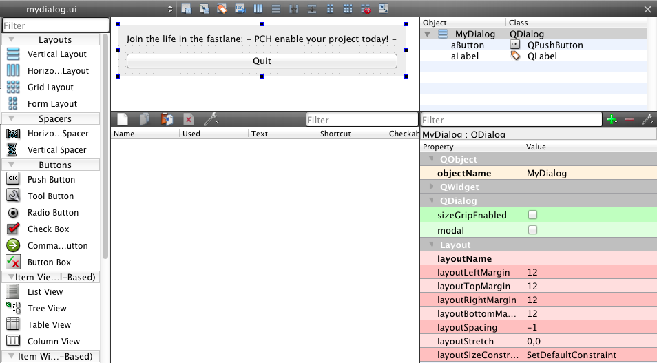

# 第9章 使用预编译的头文件

预编译头文件(PCH)是一些编译器支持的一种性能特性，用于编译稳定的代码体，并将代码的编译状态存储在二进制文件中。在后续的编译期间，编译器将加载存储的状态，并继续编译指定的文件。每次后续编译都更快，因为稳定的代码不需要重新编译。

qmake支持在一些平台和构建环境上使用预编译的标头，包括：

* Windows
* nmake
* VisualStudio项目(VS2008及更高版本)
* macOS、iOS、tvOS和watchOS
* Makefile
* Xcode
* Unix
* GCC 3.4及以上
* clang

## 向项目添加预编译头 

预编译的标头必须包含在整个项目中都是稳定的和静态的代码。一个典型的预编译的标头可能是这样的：

// Add C includes here

\#if defined \_\_cplusplus

// Add C++ includes here

\#include \<stdlib>

\#include \<iostream>

\#include \<vector>

\#include \<QApplication> // Qt includes

\#include \<QPushButton>

\#include \<QLabel>

\#include "thirdparty/include/libmain.h"

\#include "my\_stable\_class.h"

...

\#endif

注：一个预编译的头文件需要分离的C包含和C++包含，因为C文件的预编译的头文件可能不包含C++代码。

### 项目选项 

要使项目使用预编译的头文件，您只需要在项目文件中定义PRECOMPILED\_HEADER变量：

PRECOMPILED\_HEADER = stable.h

qmake将处理其余的部分，以确保创建和使用预编译的头文件。您不需要在HEADERS中包含预编译的头文件，因为如果配置支持预编译的头文件，那么qmake就会这样做。

针对Windows的MSVC和g++规格(specs)默认启用precompile\_header。

使用此选项，在使用预编译头时，可以在项目文件中触发条件块以添加设置。例如：

precompile\_header:!isEmpty(PRECOMPILED\_HEADER) {

DEFINES += USING\_PCH

}

要对MSVC nmake目标上的C文件使用预编译头，请将precompile\_header\_c添加到CONFIG变量中。如果标头也用于C++，并且它包含C++的关键字/include，请附上#ifdef\_\_cplusplus。

## 关于可能问题的说明 

在某些平台上，预编译头文件的文件名后缀与其他对象文件的相同。例如，以下声明可能会导致生成两个同名的不同对象文件：

PRECOMPILED\_HEADER = window.h

SOURCES = window.cpp

为了避免类似这样的潜在冲突，请为预编译的头文件提供独特的名称。

## 示例项目 

您可以在Qt发行版的示例/qmake/预编译目录中找到以下源代码：

#### mydialog.ui 

下图显示了Qt Creator设计模式下的mydialog.ui文件。您可以在“编辑”模式下查看该代码。

### stable.h 

/\* Add C includes here \*/

\#if defined \_\_cplusplus

/\* Add C++ includes here \*/

\# include \<iostream>

\# include \<QApplication>

\# include \<QPushButton>

\# include \<QLabel>

\#endif

### myobject.h 

\#include \<QObject>

class MyObject : public QObject

{

public:

MyObject();

\~MyObject();

};

### myobject.cpp 

\#include \<iostream>

\#include \<QDebug>

\#include \<QObject>

\#include "myobject.h"

MyObject::MyObject()

: QObject()

{

std::cout << "MyObject::MyObject()\n";

}

### util.cpp 

void util\_function\_does\_nothing()

{

// Nothing here...

int x = 0;

\++x;

}

### main.cpp 

\#include \<QApplication>

\#include \<QPushButton>

\#include \<QLabel>

\#include "myobject.h"

\#include "mydialog.h"

int main(int argc, char \*\*argv)

{

QApplication app(argc, argv);

MyObject obj;

MyDialog dialog;

dialog.connect(dialog.aButton, SIGNAL(clicked()), SLOT(close()));

dialog.show();

return app.exec();

}

### precompile.pro 

TEMPLATE = app

LANGUAGE = C++

CONFIG += cmdline precompile\_header

\# Use Precompiled headers (PCH)

PRECOMPILED\_HEADER = stable.h

HEADERS = stable.h \\

mydialog.h \\

myobject.h

SOURCES = main.cpp \\

mydialog.cpp \\

myobject.cpp \\

util.cpp

FORMS = mydialog.ui
